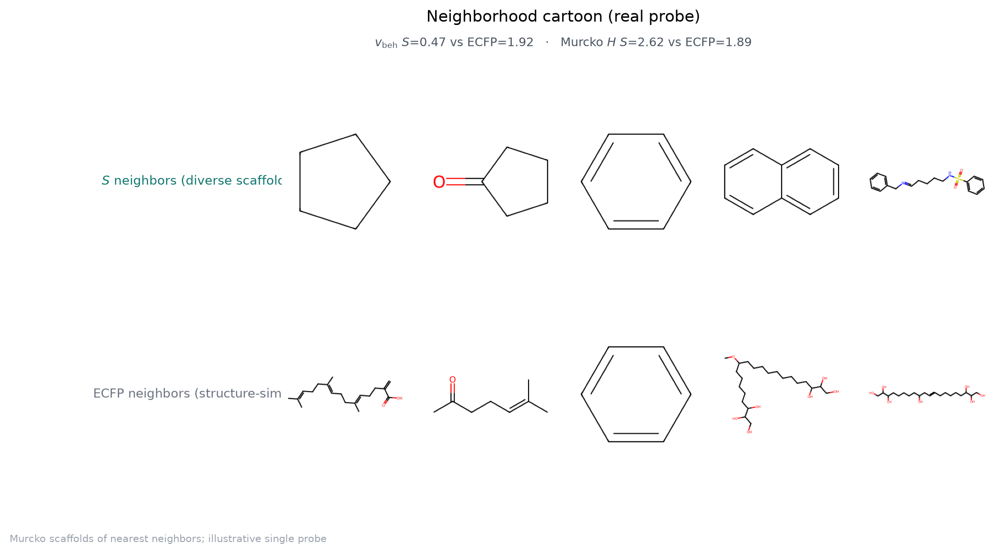
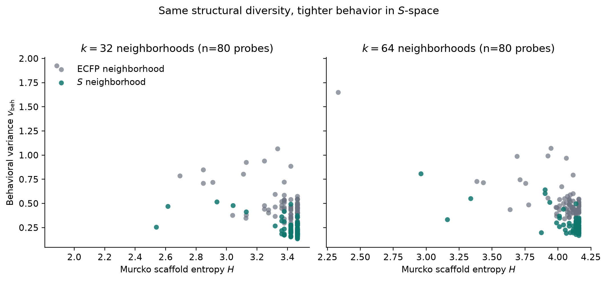
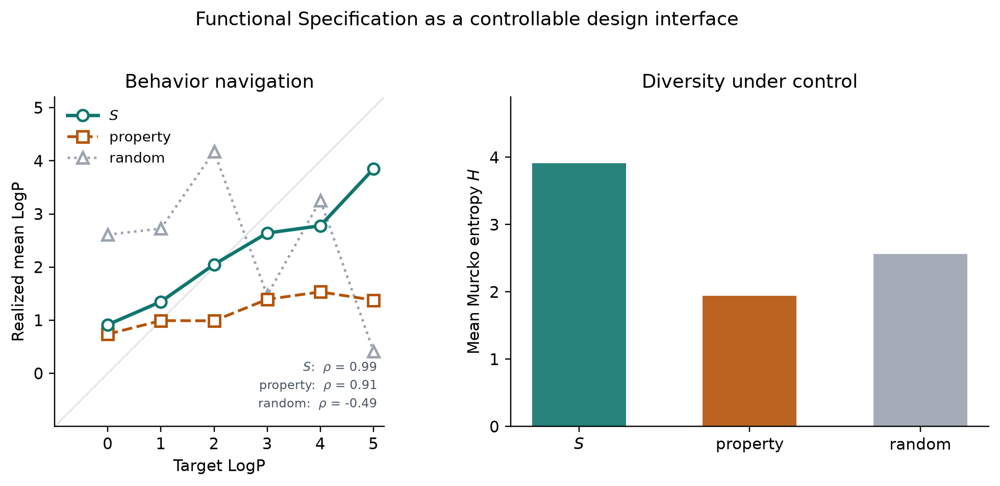

# Functional Specification

**One molecular behavior. Many scaffolds. A learnable, testable interface between design intent and chemistry.**

This repository shows that molecular *function* (desired behavior under surrogate physicochemical and interaction proxies) can be learned as an explicit **Functional Specification** \(S\), and that a **single** \(S\) can be realized by **chemically diversified scaffolds** with stable behavior. The work is an experimental MVP for a behavioral design interface in molecular generation—not a claim of a universal molecular language.

<p align="center">
  
</p>

---

## Why this matters

Molecular design separates **intent** (“what should the molecule *do*?”) from **realization** (“which concrete structure?”). Fingerprints and descriptors organize chemical space by *structure*. Design problems need a different object: a reusable conditioning interface that states functional requirements, then admits many structural solutions.

**Central result.** Soft neighborhoods in learned Spec space are as structurally diverse as fingerprint neighborhoods of the same size, but with substantially lower behavioral variance. Conditioning a generator on one Spec produces many scaffolds at predictable surrogate behavior—beyond conditioning on matched property descriptors alone.

That is the intellectual core of this project: **behavior can be learned and proven through diversified scaffolds for a single Spec.**

---

## Key findings (MVP)

| Result | What we measured | Takeaway |
|--------|------------------|----------|
| **Behavioral geometry** | Soft \(k\)-NN in \(S\) vs ECFP (\(k=32,64\); 80 probes) | Scaffold diversity matched; behavior variance ~½ of ECFP; \(v_S < v_{\mathrm{ECFP}}\) on **99%** of probes |
| **One Spec → many chemistries (G5)** | Fixed Spec, four sampling batches | **114** Murcko scaffolds / **136** unique molecules; batch-mean LogP std **0.12** |
| **Controllable behavior (G4)** | FAN objectives → LogP ladder | Target vs realized mean LogP \(\rho \approx \mathbf{0.99}\) |
| **Why Spec, not descriptors (G6a)** | Matched property-conditional decoder | \(S\) keeps control **and** ~**2×** scaffold diversity (56.5 vs 25.8 mean scaffolds) |
| **Payload necessity (G6b)** | Scramble / random Spec | Control and diversity collapse when \(S\) is destroyed |
| **Not a fingerprint bottleneck (E2)** | Structure vs behavior probes | E2 pass (\(\Delta \approx 0.28\)) |

<p align="center">
  
</p>

<p align="center">
  
</p>

Full tables, protocols, and figure captions: **[RESULTS.md](RESULTS.md)**. Manuscript draft: [`docs/papers/MVP_MANUSCRIPT.md`](docs/papers/MVP_MANUSCRIPT.md).

---

## What we claim — and what we do not

### We claim

1. Soft neighborhoods in \(S\) are **structure-diverse** and **behavior-coherent** relative to ECFP neighborhoods of matched size.
2. \(S\) is a **controllable generative interface**: design objectives map through on-manifold Specs to molecules whose surrogate behavior moves predictably.
3. **One Spec yields many chemistries** at stable behavior across repeats.
4. The FiLM generator **depends on the Spec payload** (scramble / random \(S\) destroy control).
5. Relative to a capacity-matched property-conditional decoder, \(S\) matches or beats property control and roughly **doubles** scaffold diversity.
6. \(S\) is **not** merely a fingerprint bottleneck (E2 pass).

### We do not claim

- A universal molecular representation or frozen transfer to arbitrary downstream tasks (**E9**; see below).
- Wet-lab endpoints (results use surrogate physicochemical / IE proxies).
- Perfect absolute LogP calibration (ladder is monotonic with offset).
- That encoder neighborhood specificity predicts generation reliability (G3 fails).
- Environment-conditioned planning / Interaction Specs (Phase II; out of scope for this MVP).
- State-of-the-art de novo generative chemistry; generation is evidence *for the interface*.

---

## Limitation: frozen transfer (E9) — stated clearly

**E9 asks:** if we freeze \(S\) and train only light prediction heads, does it beat strong baselines (e.g. ECFP) on held-out property tasks under a strict multi-task protocol?

**Result:** under that strict protocol, frozen transfer succeeds on **1 of 5** tasks (**solubility only**).

We treat this as a **negative result and scope boundary**, not a soft footnote:

| Interpretation | Detail |
|----------------|--------|
| What failed | Universal “frozen Spec beats fingerprints everywhere” |
| What remains valid | Spec as a **design / generation interface** on surrogate-aligned chemistry |
| What we do *not* write | “\(S\) replaces fingerprints on all tasks” or “transferable foundation embedding” |
| Open question | Task-adaptive heads, richer supervision, or environment-derived Specs (Phase II)—not claimed here |

NSF / grant readers: the MVP contribution is **behavioral geometry + controllable one-to-many realization**, not foundation-model transfer. E9 is reported honestly so the claim stays falsifiable.

---

## Method in one paragraph

Molecules are encoded into \(K\) learned slots, quantized with a vector-quantized codebook, and trained for multi-view **surrogate behavior** prediction (not molecule reconstruction as the planner objective). A Spec bank + Functional Abstraction Network (FAN) maps design objectives to on-manifold Specs. A SELFIES generator is conditioned on Spec via per-step FiLM. Evaluation protocols (E2, E3/G1–G5, G6a/b) test whether \(S\) organizes behavior, admits diversified scaffolds, and is necessary vs descriptors.

```text
DesignObjective  →  FAN (Spec bank)  →  FunctionalSpecification S  →  Generator  →  Molecules
```

Architecture details: [`DESIGN.md`](DESIGN.md), [`docs/MODEL_CARD.md`](docs/MODEL_CARD.md).

---

## Repository layout

| Path | Contents |
|------|----------|
| `functionalspec/` | Library: models, training, metrics, Spec interface |
| `scripts/` | Corpus prep, train, sample, eval, figure plotting |
| `configs/` | Default and ablation YAMLs |
| `docs/` | Design cards, metrics, manuscript draft, **figures** |
| `tests/` | Unit tests |
| `data/`, `runs/` | **Not shipped** — rebuild locally (see below) |

Training corpora and checkpoints are **not** included in this public repository. Rebuild from your own CSVs / companion datasets as documented in [`docs/DATA_SPEC.md`](docs/DATA_SPEC.md).

---

## Setup

Python **3.11+** and [uv](https://docs.astral.sh/uv/).

```bash
git clone https://github.com/dyashton/functional-specification.git
cd functional-specification
uv sync --extra dev
uv run pytest -q
```

GPU recommended for full training; tests and small smokes can run on CPU.

### Reproduce the evaluation story (after you prepare data + checkpoints)

```bash
# 1) Prepare corpora (paths are examples — use your local data)
uv run python scripts/prepare_corpus_a.py --input /path/to/scored_components.csv --out data/processed/corpus_a
uv run python scripts/prepare_corpus_b.py --input /path/to/compiled_ie.csv --out data/processed/corpus_b

# 2) P1: surrogate + contrastive + VQ (learns S)
uv run python scripts/train_p1.py --corpus-a data/processed/corpus_a --out runs/p1 --epochs 30

# 3) P2: Spec-conditioned SELFIES generator
uv run python scripts/train_p2.py \
  --p1-checkpoint runs/p1/p1_best.pt \
  --corpus-a data/processed/corpus_a \
  --out runs/p2_selfies_cond \
  --representation selfies --epochs 15 --cond-dropout 0.1

# 4) Spec bank → generate / eval (G1–G5, G6, figures)
uv run python scripts/build_spec_bank.py --p1-checkpoint runs/p1/p1_best.pt \
  --corpus-a data/processed/corpus_a --out runs/gen/spec_bank.npz
uv run python scripts/run_gen_eval.py   # see docs/EVAL_HARNESS.md
uv run python scripts/plot_mvp_figures.py --out-dir runs/gen/paper_figs
```

Operational pass/fail gates: [`docs/METRICS.md`](docs/METRICS.md). Checklist: [`docs/EVAL_HARNESS.md`](docs/EVAL_HARNESS.md).

---

## Broader context

Making molecular *intent* explicit—and testing that one intent supports many realizations—matters for controllable design in energy, separations, and medicinal chemistry. This MVP isolates a falsifiable interface claim before larger environment-conditioned (Phase II) systems. Related public work from the same line of research includes CO₂-binding generation and interaction-energy datasets under the same author account.

---

## Citation

Manuscript draft (working title): *Behavioral Geometry of Chemical Space: From Latent Neighborhoods to a Generative Design Interface* — see [`docs/papers/MVP_MANUSCRIPT.md`](docs/papers/MVP_MANUSCRIPT.md).

```bibtex
@misc{functional-specification-mvp,
  title        = {Functional Specifications: Controllable Behavioral Latents for Diverse Molecular Realization},
  author       = {Dy, Ashton},
  year         = {2026},
  howpublished = {\url{https://github.com/dyashton/functional-specification}},
  note         = {MVP code and results; preprint forthcoming}
}
```

---

## License

MIT — see [LICENSE](LICENSE).
