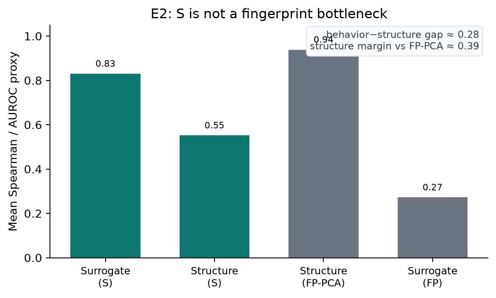
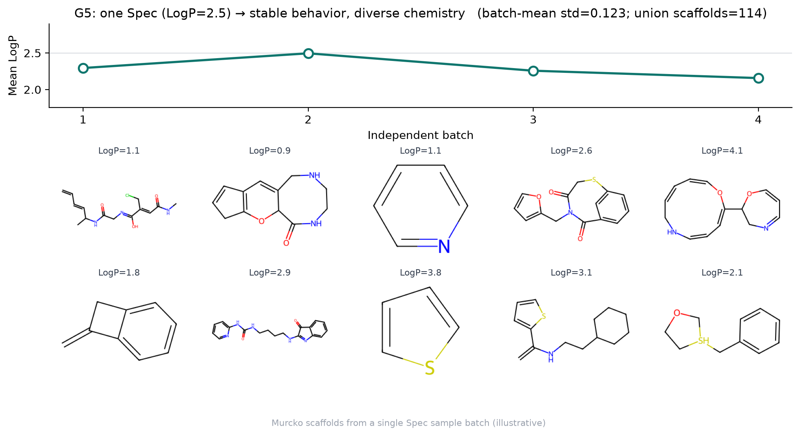

# Results summary

Evidence lock for the MVP claim: **one Functional Specification \(S\) organizes surrogate behavior and admits chemically diversified scaffolds.** Numbers below match [`docs/papers/MVP_MANUSCRIPT.md`](docs/papers/MVP_MANUSCRIPT.md). Figures live in [`docs/figures/`](docs/figures/).

---

## Part A — Behavioral geometry

Soft neighborhoods in continuous \(S\) (cosine) vs ECFP (Tanimoto), matched neighborhood size. Corpus A embeddings under frozen P1; 80 probes.

| \(k\) | mean scaffold entropy \(H\) (\(S\)) | mean \(H\) (ECFP) | mean \(v_{\mathrm{beh}}\) (\(S\)) | mean \(v_{\mathrm{beh}}\) (ECFP) | frac \(v_S < v_{\mathrm{ECFP}}\) |
|------|-------------------------------------|-------------------|-----------------------------------|----------------------------------|-------------------------------|
| 32 | 3.40 | 3.35 | **0.243** | 0.502 | **0.99** |
| 64 | 4.09 | 4.03 | **0.277** | 0.513 | **0.99** |

**Interpretation.** Structural diversity is matched; behavior is tighter under \(S\). Specificity \(R = (H_{\mathrm{Murcko}}+H_{\mathrm{BRICS}})/(v_{\mathrm{beh}}+\varepsilon)\) roughly doubles vs ECFP at \(k=64\).

**E2 (not a fingerprint bottleneck).** Structure-vs-behavior probes vs FP-PCA: pass with gap \(\Delta \approx 0.28\).

Exact VQ codes are nearly unique on Corpus A; soft geometry (not exact code equality) is the analysis object.

---

## Part B — Spec as generative control interface

Pipeline: design objective → FAN (Spec bank) → FiLM SELFIES generator (Arm A).

### G4 — LogP ladder

Targets \(\{-1,\ldots,5\}\) → realized mean LogP of accepted molecules:

| Target | −1 | 0 | 1 | 2 | 3 | 4 | 5 |
|--------|----|---|---|---|---|---|---|
| Realized mean | 0.20 | 0.98 | 1.61 | 1.93 | 2.48 | 3.13 | 4.18 |

\[
\rho(\text{target},\;\text{realized mean}) = 0.990
\]

Monotonic control with absolute offset (high targets undershoot).

### G5 — One Spec, many chemistries

Fixed Spec for `LogP=2.5`, four batches (\(n=48\)):

| Metric | Value |
|--------|-------|
| Batch-mean LogP std | **0.123** |
| Union unique molecules | **136** |
| Union Murcko scaffolds | **114** |
| Murcko entropy \(H\) | 4.44 |

**Honesty (same part).** G1 hit rates among accepted ≈ 0.3. G3: FAN confidence does **not** track acceptance (\(\rho \approx -0.47\)). E3 FiLM: 3/5 frozen codes pass cycle-style checks.

---

## Part C — Why \(S\), not descriptors alone

### G6b — Spec payload necessity

Fixed FAN Spec; mutate only `flat_S`:

| Condition | LogP \(\rho\) | hit ±0.5 | mean Murcko \(H\) |
|-----------|---------------|----------|-------------------|
| true \(S\) | **0.997** | **0.273** | **3.88** |
| scramble dims | −0.226 | 0.104 | 1.82 |
| random \(\|S\|_2\) | −0.133 | 0.091 | 1.72 |

### G6a — matched property-conditional decoder

Same GRU recipe; LogP z-score FiLM baseline:

| Model | LogP \(\rho\) | hit ±0.5 | mean Murcko \(H\) | mean scaffolds |
|-------|---------------|----------|-------------------|----------------|
| true \(S\) | **0.985** | **0.281** | **3.92** | **56.5** |
| property \(y\) | 0.906 | 0.190 | 1.95 | 25.8 |
| random \(S\) | −0.486 | 0.094 | 2.56 | 36.8 |

Descriptors give partial control; \(S\) preserves control **and** diversity.

---

## Scope limit — E9 frozen transfer

Strict multi-task frozen-\(S\) transfer: **1/5 task wins** (solubility only).

This is a **negative result / scope boundary**. The MVP does **not** claim that \(S\) is a universal frozen representation that replaces fingerprints on arbitrary held-out tasks. The supported claim is Spec as a **behavioral design interface** (Parts A–C above).

---

## What is out of scope (Phase II and beyond)

- Environment / pocket / CO₂ encoders → Interaction Spec
- Free off-manifold optimization in \(S\)
- SOTA generative chemistry benchmarks as the primary claim
- Wet-lab validation

See [`docs/PHASE2.md`](docs/PHASE2.md).
